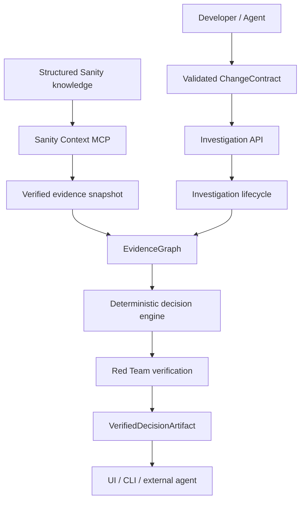

# Relia

Evidence-backed verification infrastructure for software changes.

Relia investigates whether a proposed software change is safe by traversing structured technical evidence, attacking its own decision, and issuing a reproducible machine-readable proof artifact.

Current knowledge scope: Next.js, React, React DOM, Node.js, and TypeScript. The checked-in Sanity evidence snapshot contains 52 Relia records. The live Sanity Context MCP integration is independently smoke-tested against project `gjy7dyq2`, dataset `production`.

## Problem

Version upgrades cross framework requirements, runtime floors, package relationships, migrations, and conditional rules. A document search can retrieve relevant text without proving that the rule applies to the target version or environment. Relia resolves those structured relationships and keeps missing evidence unresolved.

## Why structured content matters

Relia's evidence graph preserves typed references, version scope, exceptions, migrations, validity metadata, and source provenance. A decision can follow multiple linked records to its source. The graph wraps the existing Sanity snapshot; it does not maintain a second knowledge dataset.

## Architecture



Production investigations query the live Sanity Context MCP endpoint with GROQ on every request. The response is checked against project `gjy7dyq2.production` and must include all eight Relia schema types before reasoning begins. Local development and benchmark runs use the checked-in snapshot for deterministic replay; production never silently falls back to it. See [live Context deployment](docs/live-context-deployment.md).

## Sanity Context integration

Sanity project: `gjy7dyq2`; dataset: `production`. The smoke command connects to the configured Context MCP endpoint, discovers `initial_context`, `schema_explorer`, and `groq_query` (plus available dataset tools), checks the Relia schema types, and runs structured GROQ queries. It does not populate documents. Keep `SANITY_ORGANIZATION_TOKEN` and `SANITY_CONTEXT_MCP_URL` in the local environment; never commit token values.

## Investigation lifecycle

```text
ChangeContract → evidence collection → provisional decision → adversarial attack
               → final decision → proof and provenance → verified artifact
```

Red-team verification is mandatory. SAFE, BLOCKED, and UNRESOLVED results all carry the red-team execution status. A failed red-team stage produces no verified artifact. Missing evidence remains UNRESOLVED.

## VerifiedDecisionArtifact

Artifact version 1 is JSON validated by `schemas/verified-decision-artifact.schema.json`. It includes the decision, findings, constraints, evidence IDs, traversed relationships, source-linked proof, red-team result, snapshot identity, canonical contract, timestamp, and SHA-256 fingerprint. The fingerprint identifies the contract and snapshot used; it is not a digital signature.

## API

Create an investigation:

```http
POST /api/v1/investigations
Content-Type: application/json
```

```json
{
  "subject": { "technology": "nextjs", "from": "15", "to": "16" },
  "environment": { "node": "20.8", "react": "19" },
  "context": { "router": "app" },
  "requestedBy": "developer"
}
```

The response contains an investigation and, when mandatory verification succeeds, its artifact. Related endpoints retrieve the investigation, rerun the attack, and return proof or artifact:

```text
GET  /api/v1/investigations/:id
POST /api/v1/investigations/:id/attack
GET  /api/v1/investigations/:id/proof
GET  /api/v1/investigations/:id/artifact
```

The Next.js UI sends the same ChangeContract to this API. It does not contain its own reasoning implementation.

## CLI

The CLI calls the same `createInvestigation()` application service as the HTTP API:

```bash
npm run relia -- investigate \
  --technology nextjs \
  --from 15 \
  --to 16 \
  --node 20.8 \
  --react 19 \
  --router app \
  --json
```

`--json` prints the complete validated artifact. Run the deterministic three-case demo with `npm run demo:infrastructure`.

## Benchmark

Relia pilot benchmark — **12 reviewed cases**:

- Keyword / Flat retrieval: **66.7%**
- Relia: **100%**

These results are from a small reviewed pilot set and are not a general RAG benchmark. The cases and expected labels are maintained separately from the runner and have not been expanded to improve the score.

## Limitations

- Coverage is limited to the current source-backed Next.js, React, React DOM, Node.js, and TypeScript corpus; it is not general compatibility coverage.
- Local development and benchmark runs use an offline snapshot for deterministic behavior. Production investigations retrieve the current dataset through Sanity Context MCP for each decision; the benchmark remains pinned to the reviewed snapshot.
- The local investigation store is single-machine and unauthenticated. Fingerprints are reproducibility identifiers, not signed attestations.
- Decisions are bounded by available evidence and cannot establish project-specific code migrations that were not supplied as context.

## Running locally

```bash
npm install
npm run dev
```

Useful checks:

```bash
npm test
npm run typecheck
npm run benchmark
npm run demo:infrastructure
npm run build
npm run sanity:context:smoke
```

The Sanity smoke test requires locally configured `SANITY_CONTEXT_MCP_URL` and `SANITY_ORGANIZATION_TOKEN` values. Credentials belong in `.env`, which is ignored by Git.
